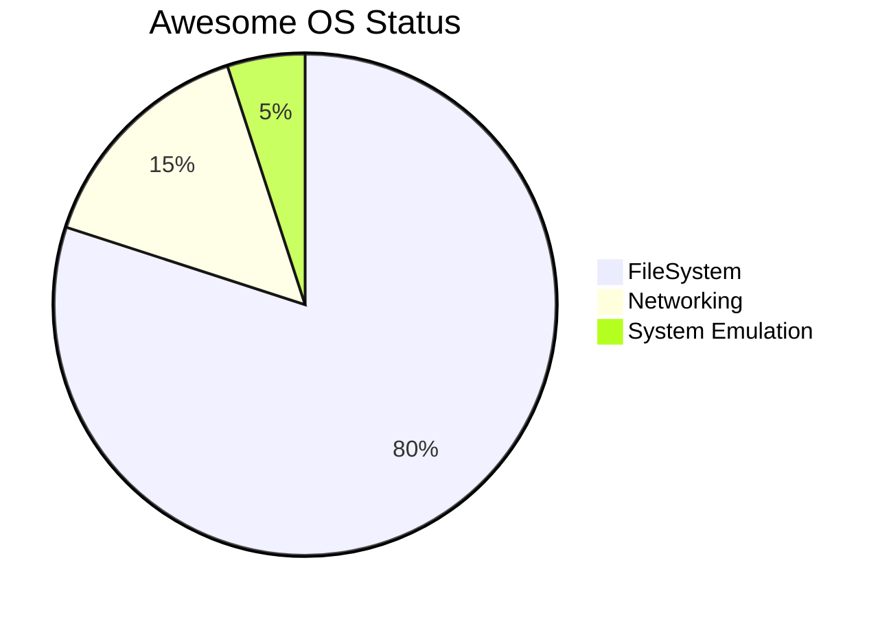

## Tracking Proposals
- [ ] https://github.com/tc39/proposal-float16array - b16float for nativ ML Training and SafeTensor Format.
- [ ] https://github.com/tc39/proposal-type-annotations - Avoid writing Type Annotations as JSDOC Comment
    - Implementations
    - [ ] https://github.com/nodejs/node/pull/53725

## Other Stuff

  

  

# The Roots and History of AwesomeOS
It all started from the hosting and distribution view of things
As everything was highly expensive the biggest advantage was to offer
generic services but with fewer costs than others. 

This resulted in the invention of our own Content Management and Delivery
Systems that got adopted in the biggest content industry on the net
We do not name it here as maybe all are already familiar with what
gets viewed most on the internet worldwide. 

else simply look at this list and then filter out all search engines and encyclopedias,
and text-based services then take the most high ranking. https://en.wikipedia.org/wiki/List_of_most_visited_websites

## Step 1 1995 => 2008
the first thing was finding a foundation as I was not familiar with content delivery at scale
fast I identified that the mysql php stack and the CGI stack were the most useful at that time
there existed a lot of independent development efforts most time went into understanding
why some did use other methods over the existing. As I had my roots in the Demo and Cracking Scene before
I was familiar with Software Reverse Engineering and did apply it to anything always I did never consult 
the manuals at this time I did always read the code. It did not scale and it was highly inefficient at 
this point but led after that to what it is today. So there where an exponential progression after
2010 we made big jumps and did not think about intermediate steps anymore.

Searchability got identified as the bottleneck for the worldwide scale of knowledge
(Important note from 2023 ChatGPT did not improve on that without the right prompt you will
never get the right answer) It was clear without the right question the right answers will not come up

Declarative rules procedural programming. Almost any program and application was at last in production
in need of batch procedures to maintain it in production. 

Creating framework integrations for Wordpress to have a widely accepted way and standard to depend on.

the LAMP Stack got born which lead to bitnami XAMPP you name it. 

## Step 2 - September 2008 
The German market as a Nativ German I was interested in taking over the local market via technical outperforming competitors using the ability of software generation based on predefined generators and rules.

Reversing Stackoverflow It was created in 2008 by Jeff Atwood and Joel Spolsky and connects Questions to Answers we were tracking the answers
we did know a lot of correct answers by this time and invested in scanning for occurrences and indicators
for the right answers (not the chosen accepted correct answers)

Finding the right questions. And build frameworks and SDKs out of it. 

The V8 assembler is based on the Strongtalk assembler. Strongtalk is a Smalltalk environment with optional static typing support. Strongtalk can make some compile time checks, and offer stronger type safety guarantees; this is the source of its name. It is non-commercial, though it was originally a commercial project developed by a small startup company named LongView Technologies (trading as Animorphic Systems)

On 7 December 2010, a new compiling infrastructure named Crankshaft was released, with speed improvements. In version 41 of Chrome in 2015, project TurboFan was added to provide more performance improvements with previously challenging workloads such as asm.js.Much of V8's development is strongly inspired by the Java HotSpot Virtual Machine developed by Sun Microsystems, with the newer execution pipelines being very similar to those of GraalVM.

In 2016, the Ignition interpreter was added to V8 with the design goal of reducing memory usage on small-memory Android phones in comparison with TurboFan and Crankshaft. Ignition is a register-based machine and shares a similar (albeit not the same) design to the templating interpreter utilized by GraalVM. This Enabled Snapshots and stack references based on our registers and was the build fundamental for our own virtual full computer system that can use multiple instruction sets.

In 2017, V8 shipped a brand-new compiler pipeline, consisting of Ignition (the interpreter) and TurboFan (the optimizing compiler). Starting with V8 version 5.9, Full-codegen (the early baseline compiler) and Crankshaft are no longer used in V8 for JavaScript execution since the team believed they were no longer able to keep pace with new JavaScript language features and the optimizations those features required.

In 2018, B8G which stands for Big Engine Got created by Frank Lemanschik and adds a Compiler Feedback infrastructure for fast live programming as also the ability to compile and link dynamic composed builds similar to the feature set of the GraalVM Project. It uses the Stealify Lang Framework to implement Polyglot cross Language Compilation. It is ECMAScript 2015 Template Literals and Tagged Template Literal String Based and is compatible with the ECMAScript Standard. As also the V8 Torque Lang as Typesafe DSL to implement ECMAScript it self implementing torque lang without Stealify Took around 5 months first code got shipped after 2 months.

In 2020 JustJS got Released by Andrew Johnston introducing a public example of Component and Build implementation for v8 that is similar to what B8G is doing but without the tooling and integrations.
But it produced Standalone Binarys based on the existing google-source-repo tree and outperformed everything
in the https://www.techempower.com/benchmarks/#section=data-r21&test=composite benchmark.

In 2021, a new tiered compilation pipeline was introduced with the release of the SparkPlug compiler, which supplements the existing TurboFan compiler within V8, in a direct parallel to the profiling C1 Compiler used by GraalVM. And Frank did start to compose the documentation for a complete refactoring of the chromium google source code repo tree and its dependencies into components that follow the same principles as the JustJS
example as also lay the foundation for Chromium Virtual Environments a complete build system for the chromium
platform to cross-compile it with the help of wasm and wasix for Multiple Architectures directly in a Browser
or WInterOp Environment like NodeJS or Deno.

## 2023 and the future features?
Writing code for multiple platforms in ASM is faceable and possible via our own Chromium LLM
It contains the Chromium Language understanding and grasp. And now leads to even faster iterations
we expect the next generation of Chromium to be maybe as accessible to new developers as also
Oldschool Assembler warrios. Combined with our research from 2016 was mainly about Bayesian and other
algorithms to optimize infrastructure at scale via infrastructure simulation to study resource management and scheduling policies. Needed for Web 4.0 which is for obvious reasons a gigantic mega pc with
never seen capabilities and scheduling tasks on such a gigantic computer is highly complex.

## Updates mid 2023
I veryfied a lot of my AI Research whith a peer group called "IRL Alpha" "AI Church" on twitch. It is composed out of Web 3.0
Insiders and discusses AI Topics highly recommended content. Anyway i did mostly work on 
- PouchDB Internals (CouchDB && Sync implemented in ECMAScript)
- Rollup Bundler (Interop with promises as dynamic import for rollup builds in the browser and WInterOP Environments)
  - why rollup? It is a subset of the acorn ecmascript parser specialised on import export and sideEffect detection
  - why rollup? Good instruction based builds that can fix Environment dependend legacy code.
- comming up with rules for WInterOP Builds.
  - require needs to get import('./relativePath') or import from './relativePath'
  - absolutePathes always need to get transpiled to relative path
  - inlining none computed dynamic imports is always used when rollup is used to fix the code
  - you do not need to use rollup for none inlining builds.
  - never import isomorphic code refactor it to indipendent entrypoints.
  - link your fetch worker to the opfs it is better then the cache storage.
  
## Takeaways
We do not allocate what we create. When implementing a language VM, there are several choices on how to implement the runtime and standard library. We have tried many different approaches over the years: handwritten assembly, C++, self-hosted (i.e., using JavaScript), and more. With V8 Torque implemented via Stealify Lang which is a DSL Implementation Framework, we now have our domain-specific language to write ECMAScript and WASIX Compatible built-in Components that do offer nativ system capabilities exposed as zero cost fast call-able handles with buildIn Typesafty and Security.

This also allows us to make WASIX more productive via Offering Additional WASM Posix with direct bindings to nativ posix standard api's
that you can use like any other posix system interactive and none interactive. This closes the missing gap and gives us AwesomeOS which is mainly the successor of NodeOS.
