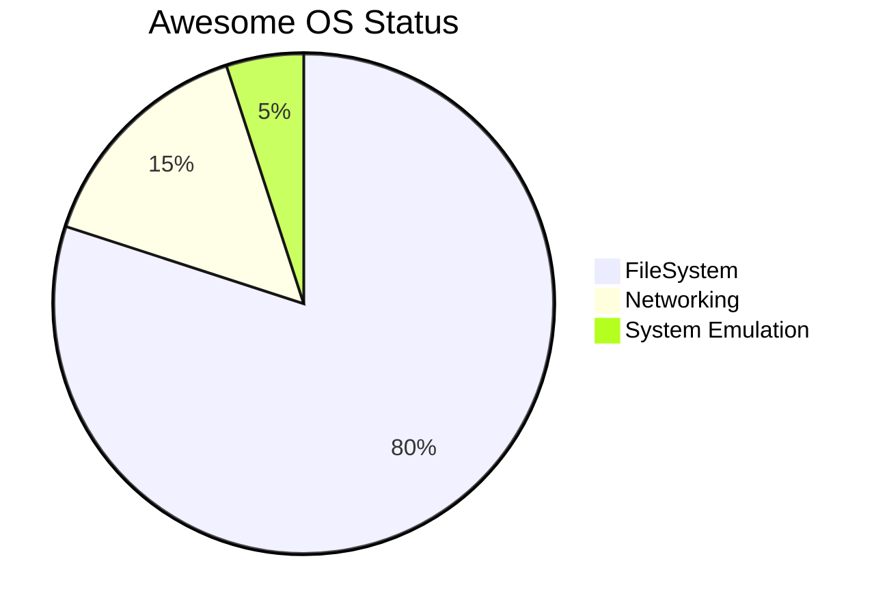

### The Evolution and Legacy of AwesomeOS  

The journey of AwesomeOS began with a focus on hosting and distribution, addressing the high costs of such services by offering generic, cost-effective alternatives. This approach catalyzed the development of proprietary Content Management and Delivery Systems, which became widely adopted in the most-viewed content industry on the internet—its identity easily deduced by excluding search engines, encyclopedias, and text-based services from [this list](https://en.wikipedia.org/wiki/List_of_most_visited_websites).

---

### Phase 1: Foundations (1995–2008)  

The initial phase centered on mastering scalable content delivery. With limited prior experience, we identified the utility of the MySQL-PHP and CGI stacks, investing significant time in understanding the methods and motivations behind competing approaches. Leveraging a background in the demo and reverse engineering scenes, we avoided manuals, focusing instead on dissecting code—a method that, while initially inefficient, laid the groundwork for future exponential growth post-2010.  

#### Key Challenges and Breakthroughs:  
1. **Searchability as a Bottleneck**: It became evident that without precise questions, obtaining accurate answers was nearly impossible. This insight highlighted the need for better indexing and query refinement systems.  
2. **Procedural Automation**: Declarative rules and batch processing were identified as critical for maintaining applications in production, driving early frameworks like WordPress integrations.  
3. **The LAMP Stack**: Standardizing tools led to the creation of the LAMP stack, later popularized by platforms like Bitnami and XAMPP.  

---

### Phase 2: Expansion (2008–2010)  

#### Entering the German Market  
As a native German, dominating the local market became a priority. Technical superiority was achieved through software generation driven by predefined rules and generators.  

#### Reverse Engineering Insights  
Reverse engineering platforms like Stack Overflow, launched in 2008, enabled tracking and validating correct answers. This approach guided the development of frameworks and SDKs optimized for relevant questions and answers.  

#### V8's Evolution and Influence  
Inspired by the Java HotSpot VM, Google's V8 engine adopted innovations like Crankshaft (2010), TurboFan (2015), and Ignition (2016). These advancements reduced memory usage, enhanced performance, and introduced the concept of snapshots and stack references. Our integration of these technologies culminated in **B8G (Big Engine)** in 2018, which added a compiler feedback infrastructure for dynamic, polyglot builds via the Stealify Lang Framework.  

---

### Modern Advancements and Beyond (2018–2023)  

#### Breakthrough Projects  
1. **Stealify Lang Framework**: A DSL enabling type-safe ECMAScript and WASIX-compatible components with zero-cost, secure system capabilities.  
2. **JustJS (2020)**: Inspired by our B8G architecture, JustJS demonstrated standalone binaries optimized for performance, showcasing component-based implementations for V8.  
3. **Chromium Virtual Environments (2021)**: A comprehensive refactoring of Chromium's source code to enable cross-compilation across architectures using WASM and WASIX.  

#### Infrastructure at Scale  
By leveraging Bayesian algorithms and infrastructure simulations, we developed methods to optimize resource management and scheduling for the envisioned "Web 4.0," characterized as a colossal, interconnected system with unprecedented computing capabilities.  

---

### Updates and Takeaways (2023 and Beyon)  

1. **AI Collaboration**: Engaging with peer groups like "IRL Alpha" and "AI Church" fostered discussions on advancing AI tools, including PouchDB internals and the Rollup bundler.  
2. **Optimizing WASIX**: Enhancing productivity through WASM-Posix bindings, enabling seamless integration with native POSIX systems for both interactive and non-interactive applications.  

#### Core Principles for AwesomeOS:  
- **Platform Independence**: ASM-based development for multi-platform compatibility.  
- **Zero-Cost Abstractions**: Secure, type-safe system capabilities without overhead.  
- **Declarative Design**: Frameworks and SDKs designed for ease of use and rapid iteration.  

---

### Conclusion  

AwesomeOS represents the culmination of decades of technological exploration and refinement, transitioning from niche systems to industry-defining innovations. By integrating foundational principles with cutting-edge advancements in AI, WASM, and VM design, AwesomeOS stands as a testament to the enduring impact of persistent innovation in system-level computing.

## Tracking Proposals
- [x] Stage 3 - https://github.com/tc39/proposal-float16array - b16float for nativ ML Training and SafeTensor Format.
- [ ] https://github.com/tc39/proposal-type-annotations - Avoid writing Type Annotations as JSDOC Comment
    - Implementations
        - [ ] https://github.com/nodejs/node/pull/53725 --experimental-strip-types
- [ ] Stage 2 Typescript ESM Compatible build got introduced 01.10.2024 - CodeOss ESM Extensions via Source Maps.
   - [ ] TODO: Write a good explainer what why who and where and when like enables costimization of codeOss without rebuilding so can run multiple instances with diffrent Settings. Nothing needs to be more easy code costumizeable as the IDE!

## Other Stuff

  

  

