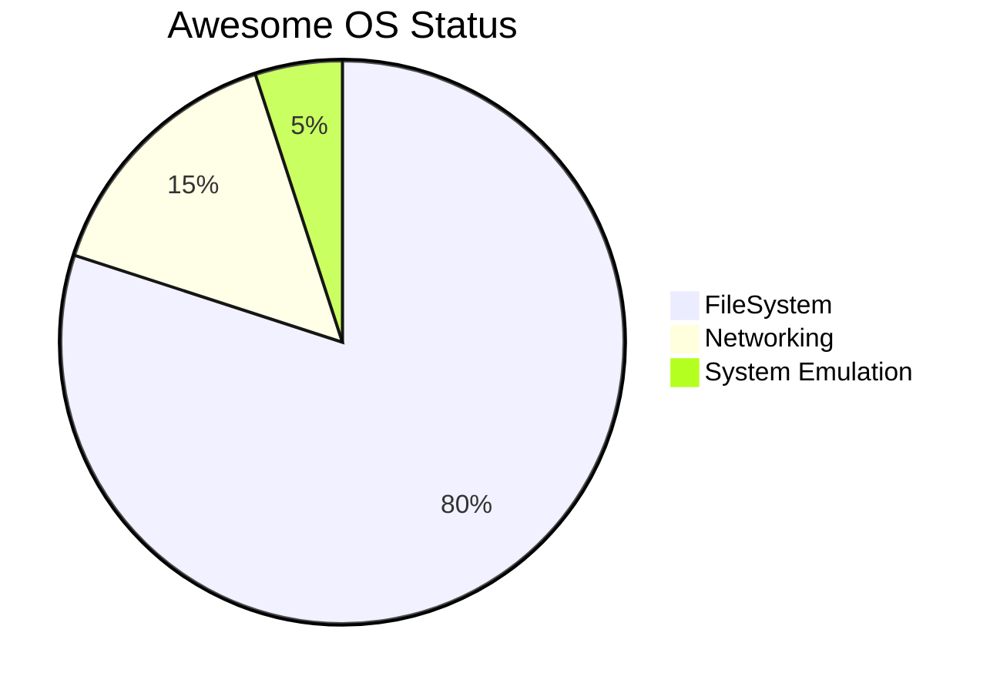

# Introduction

What i do:  I pursues research on Applied Artificial Intelligence (AAI) techniques.

What we research:  I am mainly studying Natural Language Processing (NLP) and Multimodal Systems.
Code Based Compression (CBC).

Research Topics: Large Language Model, Vision-Language Model, Machine Translation, and Dependency Parsing, Benchmarking, Bayesian optimization, Linear Regression,
Data Structures and Compression, Compilers and Coding Language Design, Education of Coders, Social and General Physical Economy.

## Under the AwesomeOS Umbrella 
- Training of tiny self improving LM's
- Multi Agent System Training and Alignment via Recursion and tool calling 
- Using Stealify Lang as Compressed Representation of data that gets Generated and not persisted.
- QuaternionFS QuaternionDB MultiDimensional Rotatable data Stored in Stealify Lang.
- NNC Neuronal Network Compression.

### Research 2024
- How to Implement ICL (In Context Learning) without retraining the existing LLM
- How to Implement Large Context Models.
- Model Destillation.
- Test Suite for logical Reasoning about my Own Research Topics.
- LLM Routing in MoE Systems
- Model Merging
- False Assumptions about LLM's and how they work from the InnerSide Found Facts
   - Dataset creation did show that we need to add none relevant data to even overwrite and correct reasoning failures Franks claim of "we can not controll what comes out but we can control what goes in" Does apply
   - Training a existing LLM is like finding what it likes most and then use that part of the "m_head" and attach new Data to it distributed in a way that it outweights the existing false data.
     - Similar to the incontext learning effects that take place when the right mixiture of none related data that is needed to prefix the real data. 

# Older Readme

### The Evolution and Legacy of AwesomeOS  

The journey of AwesomeOS began with a focus on hosting and distribution, addressing the high costs of such services by offering generic, cost-effective alternatives. This approach catalyzed the development of proprietary Content Management and Delivery Systems, which became widely adopted in the most-viewed content industry on the internet—its identity easily deduced by excluding search engines, encyclopedias, and text-based services from [this list](https://en.wikipedia.org/wiki/List_of_most_visited_websites).

---

### Phase 1: Foundations (1995–2008)  

The initial phase centered on mastering scalable content delivery. With limited prior experience, we identified the utility of the MySQL-PHP and CGI stacks, investing significant time in understanding the methods and motivations behind competing approaches. Leveraging a background in the demo and reverse engineering scenes, we avoided manuals, focusing instead on dissecting code—a method that, while initially inefficient, laid the groundwork for future exponential growth post-2010.  

#### Key Challenges and Breakthroughs:  
1. **Searchability as a Bottleneck**: It became evident that without precise questions, obtaining accurate answers was nearly impossible. This insight highlighted the need for better indexing and query refinement systems.  
2. **Procedural Automation**: Declarative rules and batch processing were identified as critical for maintaining applications in production, driving early frameworks like WordPress integrations.  
3. **The LAMP Stack**: Standardizing tools led to the creation of the LAMP stack, later popularized by platforms like Bitnami and XAMPP.  

---

### Phase 2: Expansion (2008–2010)  

#### Entering the German Market  
As a native German, dominating the local market became a priority. Technical superiority was achieved through software generation driven by predefined rules and generators.  

#### Reverse Engineering Insights  
Reverse engineering platforms like Stack Overflow, launched in 2008, enabled tracking and validating correct answers. This approach guided the development of frameworks and SDKs optimized for relevant questions and answers.  

#### V8's Evolution and Influence  
Inspired by the Java HotSpot VM, Google's V8 engine adopted innovations like Crankshaft (2010), TurboFan (2015), and Ignition (2016). These advancements reduced memory usage, enhanced performance, and introduced the concept of snapshots and stack references. Our integration of these technologies culminated in **B8G (Big Engine)** in 2018, which added a compiler feedback infrastructure for dynamic, polyglot builds via the Stealify Lang Framework.  

---

### Modern Advancements and Beyond (2018–2023)  

#### Breakthrough Projects  
1. **Stealify Lang Framework**: A DSL enabling type-safe ECMAScript and WASIX-compatible components with zero-cost, secure system capabilities.  
2. **JustJS (2020)**: Inspired by our B8G architecture, JustJS demonstrated standalone binaries optimized for performance, showcasing component-based implementations for V8.  
3. **Chromium Virtual Environments (2021)**: A comprehensive refactoring of Chromium's source code to enable cross-compilation across architectures using WASM and WASIX.  

#### Infrastructure at Scale  
By leveraging Bayesian algorithms and infrastructure simulations, we developed methods to optimize resource management and scheduling for the envisioned "Web 4.0," characterized as a colossal, interconnected system with unprecedented computing capabilities.  

---

### Updates and Takeaways (2023 and Beyon)  

1. **AI Collaboration**: Engaging with peer groups like "IRL Alpha" and "AI Church" fostered discussions on advancing AI tools, including PouchDB internals and the Rollup bundler.  
2. **Optimizing WASIX**: Enhancing productivity through WASM-Posix bindings, enabling seamless integration with native POSIX systems for both interactive and non-interactive applications.  

#### Core Principles for AwesomeOS:  
- **Platform Independence**: ASM-based development for multi-platform compatibility.  
- **Zero-Cost Abstractions**: Secure, type-safe system capabilities without overhead.  
- **Declarative Design**: Frameworks and SDKs designed for ease of use and rapid iteration.  

---

### Updates (2024–2025)  

Recent advancements in **neural network compression** and **large language models (LLMs)** have transformed the way systems and applications are built. By abstracting and reducing the input required to configure and deploy systems, these technologies enable significantly faster build times, fewer errors, and smaller disk footprints.  

Key improvements include:  
1. **Distributed and Shared LLMs**: Leveraging LLMs in distributed architectures accelerates the development pipeline and ensures high consistency across builds.  
2. **Redundancy Elimination**: Comprehensive deduplication at the code and resource levels minimizes inefficiencies.  
3. **Enhanced Filesystem Utilization**: Advanced filesystems like **BTRFS** are employed to perform block-level deduplication and optimize I/O through filesystem worker pools, further scaling input/output operations for high-performance builds.  

These updates emphasize a future where system creation is not only faster but also more resource-efficient, laying the groundwork for the next evolution of application development and deployment.

---

### Conclusion  

AwesomeOS stands as a groundbreaking achievement in the evolution of operating systems and application frameworks, blending decades of innovation with modern advancements. From its origins in scalable content delivery to its role in reshaping developer tools, AwesomeOS has consistently pushed the boundaries of what’s possible.  

The latest updates in neural network compression and distributed LLMs mark a significant leap forward. These technologies have redefined how systems are built and maintained, enabling unprecedented build speeds, reduced error rates, and highly efficient resource utilization. By harnessing the power of advanced filesystems like BTRFS for block-level deduplication and I/O scaling, AwesomeOS has set a new benchmark for performance and reliability.  

As we look to the future, AwesomeOS positions itself as the foundation for a new era of computing, where systems are faster, more intelligent, and resource-conscious. It encapsulates a vision where innovation converges with efficiency, empowering developers and enterprises to create without limits, paving the way for the emergence of Web 4.0 and beyond.

---

## Tracking Proposals
- [x] Stage 3 - https://github.com/tc39/proposal-float16array - b16float for nativ ML Training and SafeTensor Format.
- [ ] https://github.com/tc39/proposal-type-annotations - Avoid writing Type Annotations as JSDOC Comment
    - Implementations
        - [ ] https://github.com/nodejs/node/pull/53725 --experimental-strip-types
- [ ] Stage 2 Typescript ESM Compatible build got introduced 01.10.2024 - CodeOss ESM Extensions via Source Maps.
   - [ ] TODO: Write a good explainer what why who and where and when like enables costimization of codeOss without rebuilding so can run multiple instances with diffrent Settings. Nothing needs to be more easy code costumizeable as the IDE!

## Other Stuff

  

  

